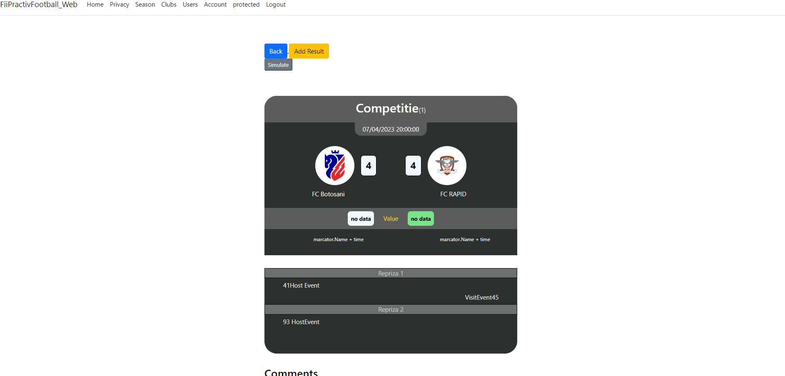
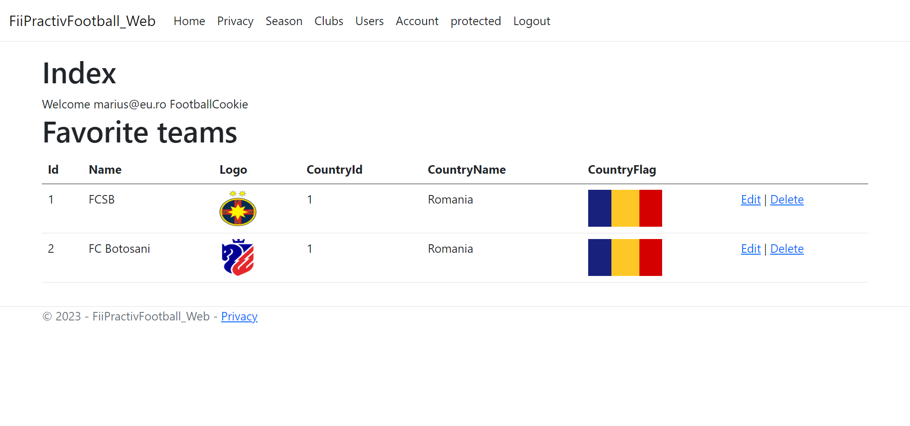
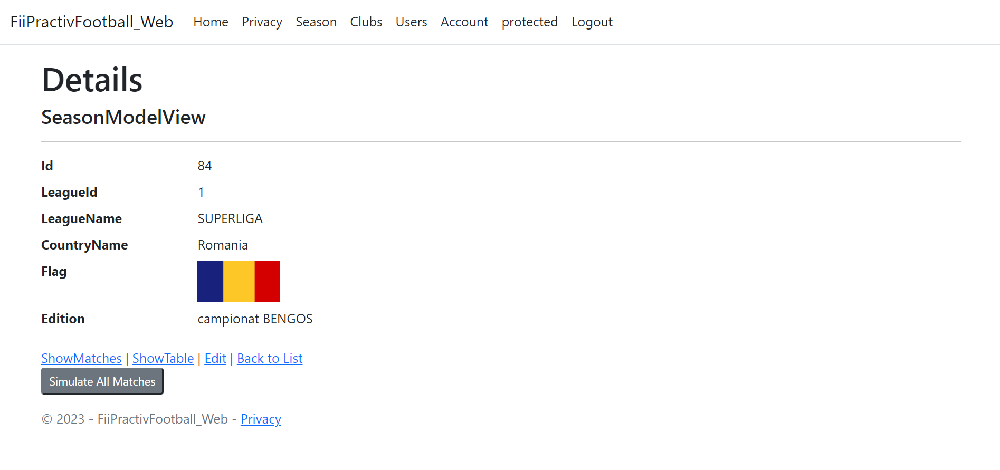
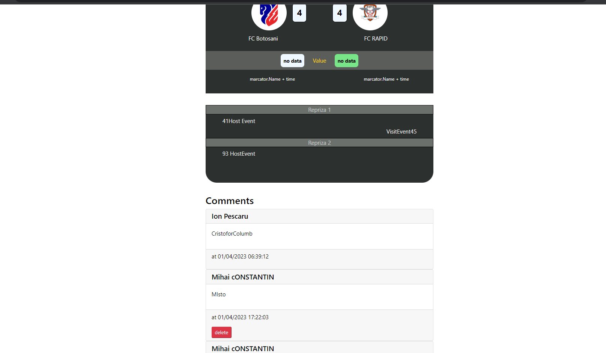

## FiiPracticFootball

## About

This application was developed during the training I had at FiiPractic in 2023, held by Expert Network and named Web Development with ASP.NET.
The application has a register/login system encrypted using a HASH function and a SALT for the passwords.
The admin has CRUD permissions over football clubs and leagues.
Every league has specific seasons with scheduled matches, which can be simulated by the admin.
Every user can follow their favorite team and comment on any match.

## Technologies used

The Back-end was made using the .NET framework in C#
The Front-end was made using RazorBlade also from .NET
The data persistance is implemented using SQL_SERVER

## Screenshots

## The Match page

## The Favorite Teams page

## The League page

## The Match comments section

